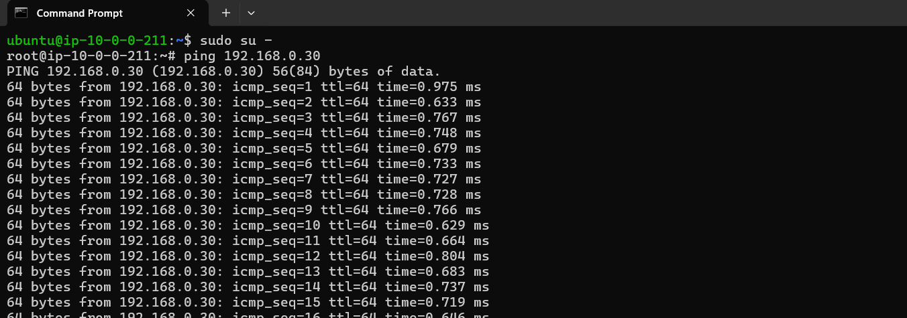
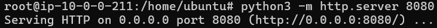
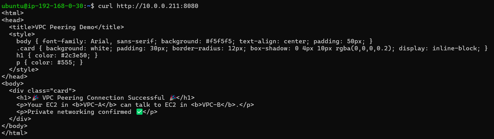
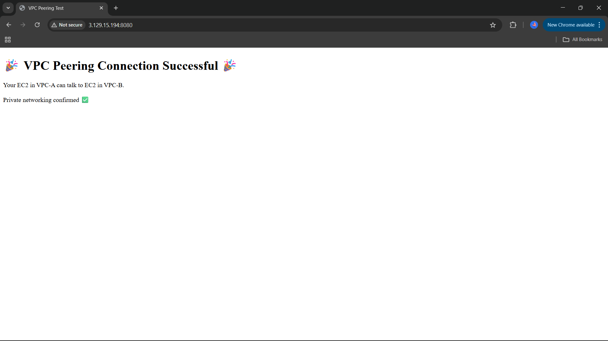

# 🌐VPC Peering: Secure EC2 Communication


A project that connects two AWS VPCs using **VPC Peering** and tests private communication between EC2 instances using a simple Python HTTP server.

## 📝Introduction

This project demonstrates secure communication between two AWS Virtual Private Clouds (VPCs) using VPC Peering. An EC2 instance in one VPC hosts a Python HTTP server, while another EC2 instance in a different VPC accesses it over a private IP. The setup highlights how VPC Peering enables cross-VPC communication without exposing resources to the public internet.

## 🚀 Features

- **VPC Peering Setup** – Establishes secure connectivity between two independent VPCs.  
- **Private EC2 Communication** – Access an EC2 instance in VPC A from another in VPC B using its private IP.  
- **Custom HTTP Server** – Hosts a Python HTTP server on port 8080 to demonstrate real application-level traffic (not just ping/ICMP).  
- **Routing Configuration** – Properly updates route tables to enable cross-VPC communication.  
- **Security Groups & Firewall Rules** – Configures rules to allow HTTP traffic while maintaining network security.  
- **Hands-on AWS Networking** – Covers essential AWS networking resources: VPC, Subnets, Internet Gateways, Route Tables, and EC2.  
- **Scalable Blueprint** – Can be extended to multi-tier architectures or hybrid cloud connectivity.  


## 🛠️ Technologies Used  

This project leverages the following AWS services and tools:  

- ☁️ **Amazon VPC (Virtual Private Cloud)**  
  Creates isolated private networks where resources are deployed.  

- 🔗 **VPC Peering**  
  Establishes secure connectivity between two VPCs without using the public internet.  

- 🖥️ **Amazon EC2 (Elastic Compute Cloud)**  
  Hosts instances for testing cross-VPC connectivity.  

- 🌍 **Route Tables**  
  Enable traffic routing between peered VPCs.  

- 🔒 **Security Groups**  
  Control inbound and outbound traffic between EC2 instances.  

- 📡 **Private IP Connectivity**  
  Ensures communication happens via private IPs only, avoiding exposure to the internet.  


## ⚙️ Installation

Follow these steps to set up **AWS VPC Peering with Private EC2 Connectivity**:

1. **Prerequisites**  
   - An active **AWS account**  
   - AWS CLI installed and configured (`aws configure`)  
   - Key pairs for EC2 SSH access  

2. **Create VPCs**  
   - Create **VPC A** (CIDR: `10.0.0.0/16`)  
   - Create **VPC B** (CIDR: `192.168.0.0/16`)  

3. **Launch EC2 Instances**  
   - Launch an **EC2 instance (EC2-A)** inside VPC A  
   - Launch an **EC2 instance (EC2-B)** inside VPC B  
   - Assign **Private IPs** and **enable SSH**  

4. **Set Up VPC Peering**  
   - Go to **VPC Dashboard → Peering Connections → Create Peering Connection**  
   - Select **Requester: VPC A**, **Accepter: VPC B**  
   - Accept the peering request in VPC B  

5. **Update Route Tables**  
   - VPC A Route Table → add route to `192.168.0.0/16` via Peering Connection  
   - VPC B Route Table → add route to `10.0.0.0/16` via Peering Connection  

6. **Configure Security Groups**  
   - Allow inbound **SSH (22)** and **ICMP (ping)**  
   - Allow inbound **TCP 8080** for HTTP traffic  

7. **Verify Connectivity**  
   - SSH into EC2-A → ping EC2-B private IP  
   - SSH into EC2-B → ping EC2-A private IP  
   - Successful ping confirms VPC Peering works

    ## 🚀 Run Locally

Once setup is complete, test the project as follows:

1. **Start Python HTTP Server:-**  
- On VPC A EC2 instance (or any EC2 hosting the server):  
   ```bash
   cd /home/ubuntu   # or /home/ec2-user
   python3 -m http.server 8080

2. **Access from VPC B EC2:-**
- On VPC B EC2 instance, test private connectivity:
 ```bash
curl http://<PRIVATE_IP_OF_VPC_A_INSTANCE>:8080
```
3. **Verify Private Connectivity**

- Ping private IPs between EC2 instances

- Access the server from browser (optional, using public IP if allowed in SG)

✅ Successful curl or ping proves that VPC Peering and private EC2 communication are working.


## 💻 Usage / Examples

After completing the setup and running the Python HTTP server, you can test and use your project as follows:

### 1. Test Connectivity with Ping
- From VPC B EC2 instance, run:  
```bash
ping <PRIVATE_IP_OF_VPC_A_INSTANCE>
```
- Expected Output:
```bash
64 bytes from 10.0.0.211: icmp_seq=1 ttl=64 time=0.123 ms
64 bytes from 10.0.0.211: icmp_seq=2 ttl=64 time=0.098 ms
```
### 2. Access Python HTTP Server

- From VPC B EC2 instance, use:
```bash
curl http://<PRIVATE_IP_OF_VPC_A_INSTANCE>:8080
```
- Expected Output:
```bash
<h1>🎉 VPC Peering Connection Successful 🎉</h1>
<p>Your EC2 in VPC-A can talk to EC2 in VPC-B.</p>
```
This demonstrates real application-level traffic over the peered VPCs.
### 3. Optional: Access via Browser

- If the security group allows HTTP traffic on the public IP:
```bash
Open http://<PUBLIC_IP_OF_EC2_A>:8080 in a web browser.
```

You will see a simple web page confirming that the VPC Peering is working.
## 🖼️ Screenshots

1. **Ping Test Between EC2 Instances**


2. **Python HTTP Server Running on EC2-A**


3. **Curl Output from EC2-B**


4. **Browser Access (Optional)**



## 📝 Lessons Learned

Working on this AWS VPC Peering project helped me understand and practice several key cloud networking concepts and practical skills:

- **AWS VPC Fundamentals** – Learned how to create and configure VPCs, subnets, and route tables.  
- **VPC Peering** – Understood how to securely connect two independent VPCs and enable private communication between EC2 instances.  
- **Security Groups & Firewall Rules** – Practiced configuring inbound and outbound rules to allow SSH, ICMP (ping), and TCP 8080 traffic while maintaining network security.  
- **EC2 Instance Management** – Gained hands-on experience launching EC2 instances, assigning private/public IPs, and managing key-based SSH access.  
- **Python HTTP Server** – Used a lightweight HTTP server to simulate real application-level traffic across peered VPCs.  
- **Route Table & Connectivity** – Learned the importance of updating route tables to ensure cross-VPC communication works correctly.  
- **Debugging & Testing** – Practiced using ping, curl, and browser access to verify connectivity and troubleshoot networking issues.  
- **GitHub Documentation** – Learned to document project setup, usage, and results in a clear and professional manner.  

## ⚖️ License

This project is licensed under the MIT License - see the [LICENSE](LICENSE) file for details.


## 👩‍💻 Author
**Nishika Jaiswal**

Aspiring Cloud & DevOps Engineer

